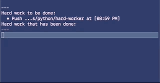

# Hard-Worker


Stay late! Get up early! Without having to stay late or get up early!

Do it all as easy as typing `hardwork`.

### What?
This script `git pushes` your changes for you automatically, really late in the evening, or early in the morning, or whenever you want.

Usecases:
1. Looking like a hard worker
2. Looking like an early riser
3. Slowly pushing several changes over the course of a week while you secretly road trip across the country

### Install
1. `curl https://raw.githubusercontent.com/slin63/hard-worker/master/hard-worker.py -o /usr/local/bin/hardworker && chmod +x /usr/local/bin/hardworker`
1. Test if it's working by starting the hardwork process with `hardwork -s`
1. You may have to change `/usr/local/bin` to some other valid directory in your `$PATH`.

### Usage
1. Start the hardwork process
    - `$ hardwork -s`
2. Enqueue the current repo to be pushed later at a random time (after 5PM local time, of course)
    - `$ hardwork`
3. Enqueue the current repo to be pushed later after a specified delay time
    - `$ hardwork -d 3 # Will push in 3 hours`


```
hardwork -d <hours> -s -h (--help)
    -d how many hours from now to git push the current git repo
    -s run the hardwork process, necessary for hardwork to... work
    -h / --help: print out this message
```
